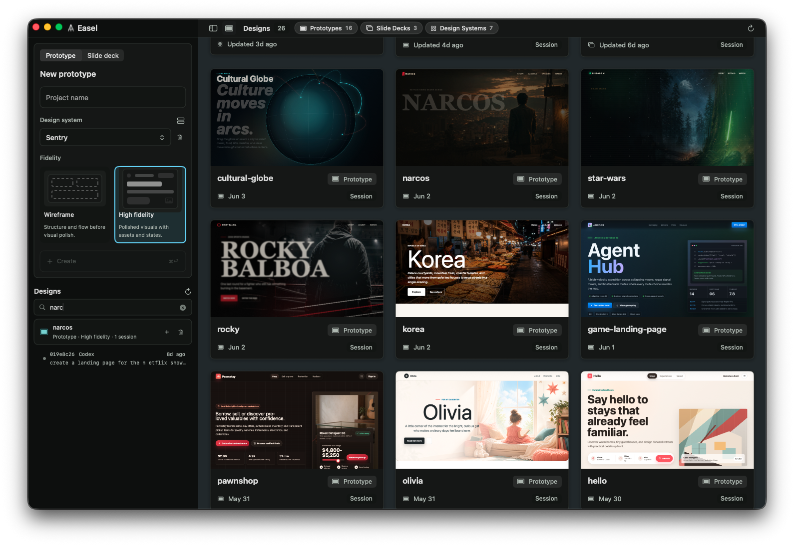
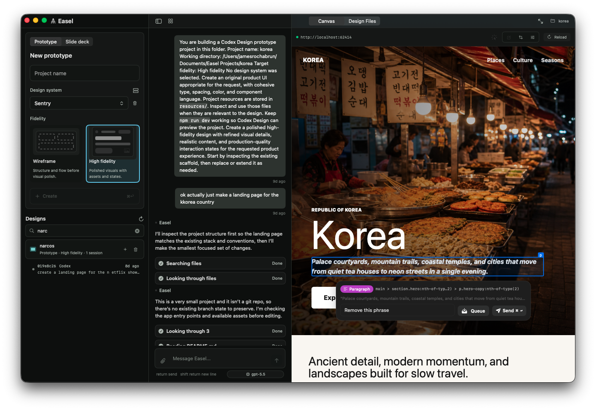
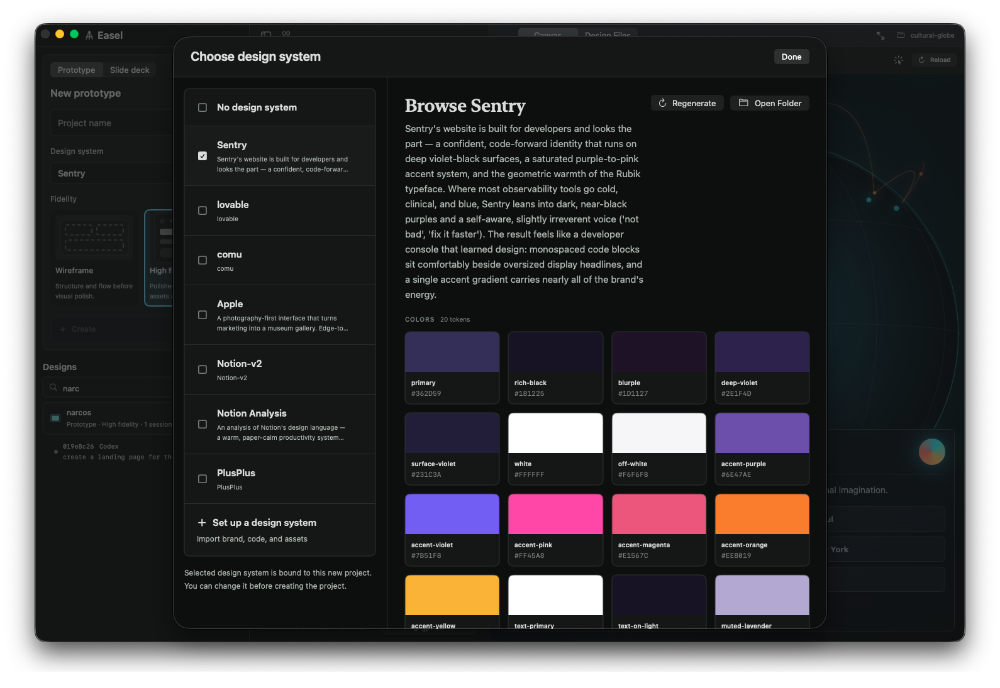
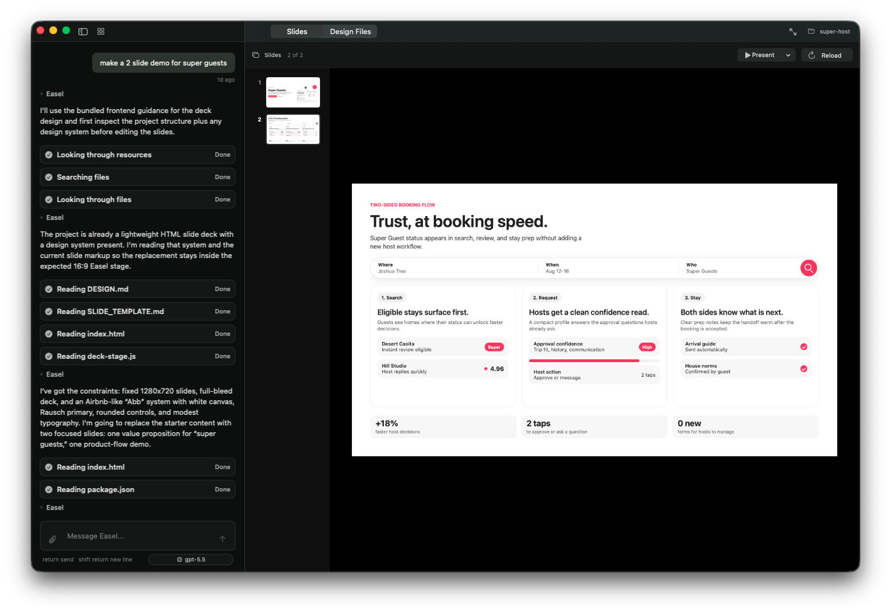
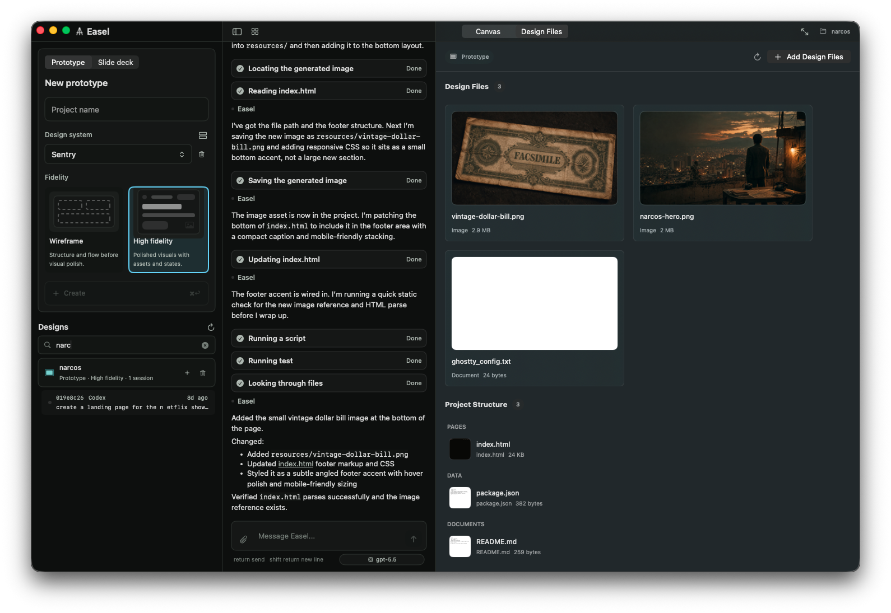
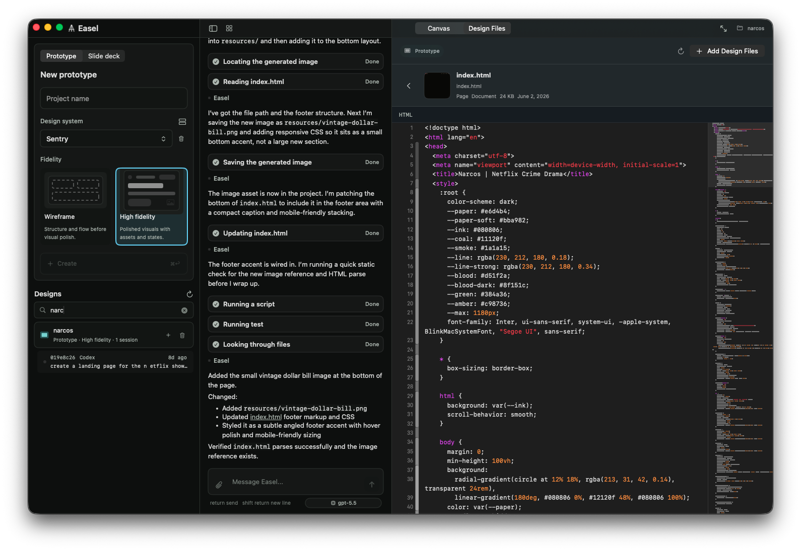

# Easel

[](LICENSE)
[](https://github.com/jamesrochabrun/Easel/actions/workflows/ci.yml)

**[⬇️ Download the latest Easel.dmg](https://github.com/jamesrochabrun/Easel/releases/latest/download/Easel.dmg)** — signed & notarized for macOS 26.2+.

Easel is a macOS workspace for AI-assisted product design and frontend iteration, powered by your choice of **Codex** or **Claude**. It brings a local project library, design-system setup, AI chat, a live web preview with a point-and-click inspector, and slide tooling together in one native SwiftUI app — so you can describe a UI, watch it build, and refine it by clicking directly on the result. Pick your provider in Settings and switch anytime.



## What Easel Does

- **Build prototypes with Codex or Claude** — Describe what you want and your chosen agent builds it in a real working directory. Easel runs the dev server, detects the URL, and shows the result in a live preview next to the chat. Pick the provider (and model) in Settings and switch anytime.
- **Iterate by clicking, not typing paths** — Toggle the inspector (`Cmd+Shift+I`), click any element in the preview, and type an instruction like "make this button bigger." Easel sends that element as context to the chat. Crop a region, queue multiple elements, or edit the backing source file directly.
- **Reusable design systems** — Create a design system once (from a description, an imported `DESIGN.md`, or AI-generated) and reuse it across projects so everything you build stays on-brand.
- **Tweak designs from Claude** — Bring in a design started in Claude as source files, assets, or a `DESIGN.md`-backed design system, then use Codex and the preview inspector to keep refining it locally.
- **Hand off to Claude or Codex** — When a prototype is ready to become real code, send the whole project to a local Claude Code or Codex CLI session in one click. Easel opens a Terminal session in the target folder, seeded with a prompt that points the agent at your project's README, resources, and design system.
- **Slide decks** — Build presentation decks the same way you build prototypes: chat to generate slides, browse them in a slide rail, and present in-tab, fullscreen, or in a new tab.
- **Animations** — Create motion-design projects with a timeline-based HTML/JSX starter, playback controls, and a reusable animation engine under `resources/`.
- **Real files you can edit** — Every project is a real folder of HTML/CSS/JS, assets, and metadata. Browse the design files, manage resources, and drop into the built-in code editor to tweak source by hand whenever you'd rather not round-trip through chat.
- **A visual design library** — All your projects and design systems appear as a searchable, filterable grid of thumbnails. Click any one to open it in the workspace.
- **Lives in your menu bar** — Easel stays in the menu bar, with quick access to the window, a floating chat bar, and "Check for Updates."

Everything you create is stored locally and independently of the app, under `~/Documents/Easel Projects/` and `~/Documents/Easel Design Systems/` — so your work survives app updates and uninstalls.

## A Closer Look

**Chat to build, then refine by clicking.** Describe a screen, watch it render in the live preview, and use the inspector to point at any element and say what to change.



**Create reusable design systems.** Pull in brand, code, and assets — or import a `DESIGN.md` — to get a token set (colors, typography, and more) that keeps every project on-brand.



**Make slide decks.** Spin up a Slide Deck project and Easel generates a full 16:9 deck you can browse slide-by-slide and present.



**Manage real design files and resources.** Each project keeps its assets, pages, and metadata in a self-contained folder you can browse right inside Easel.



**Edit code directly when you need to.** Prefer to make a change by hand? Open the source in the built-in editor with syntax highlighting and edit it directly — no need to go through chat for every tweak.



## Hand Off to a Coding Agent

When a prototype looks right, hand it off to a local coding agent to turn it into production code. From the workspace toolbar, click **Send Handoff** (the paperplane) to open the handoff dialog and configure it:

1. **Agent** — Choose **Codex** or **Claude**. Easel launches that provider's CLI in a new Terminal window using the CLI's own auth — no API keys to paste.
2. **Destination** — Pick where the agent should work:
   - **Implement in Codebase** — use the codebase you've linked to a High Fidelity project (set this from the sidebar).
   - **Select Repo** — point the agent at an existing folder or repository.
   - **Create Project** — create a fresh project folder in a directory you choose.
3. **Details** *(optional)* — Add a sentence on what to implement. Left blank, the agent is told to build "the designs in this project."
4. **Easel Resources** — Review the resources that will be handed over.

Click **Send** and Easel opens Terminal, starts the agent in the chosen working directory, and seeds it with a prompt that tells it to read your project's `README.md`, inspect `resources/` for assets and design inputs, build from `resources/design-system/DESIGN.md` when present, and treat the Easel project as read-only source material. For prototypes, the agent is asked to *productionize* the design — preserving its layout, visuals, states, and interactions — rather than restart the design process.

## Requirements

- macOS 26.2 or newer
- The Codex CLI and/or the Claude Code CLI installed and authenticated — install at least one of them. Easel delegates auth to whichever CLI you pick, so there are no API keys to paste.
- For building from source: Xcode 26.4 or newer

## Install

Download the latest signed, notarized DMG from the [**Releases**](https://github.com/jamesrochabrun/Easel/releases/latest) page, open it, and drag **Easel** to your Applications folder. Easel ships with [Sparkle](https://sparkle-project.org), so once installed it updates itself automatically — you can also check manually from the menu bar via **Check for Updates…**.

## Getting Started

1. **Launch Easel.** It opens to the Design Library and adds an icon to your menu bar.
2. **Create a design system** (recommended first step) — see the quick start below, or describe a brand and let Easel generate one.
3. **Create a project** — From the sidebar, name it, pick **Prototype**, **Slide Deck**, or **Animation**, choose a fidelity for prototypes, and select your design system. Click **Create**.
4. **Chat to build** — Describe the screen or component you want. Your selected agent (Codex or Claude) writes the files; Easel runs the server and shows a live preview.
5. **Refine visually** — Press `Cmd+Shift+I`, click an element in the preview, and tell Easel what to change.

### Quick start: import a design system from getdesign.md

The fastest way to start with a polished, on-brand look is to grab a ready-made design system from [getdesign.md](https://getdesign.md) and paste it into Easel.

1. Browse [getdesign.md](https://getdesign.md) and open any design system — for example, [SpaceX](https://getdesign.md/spacex/design-md).
2. In the **DESIGN.md** preview, click the **Copy** button to copy the full `DESIGN.md` contents (YAML front matter included).
3. In Easel, open the **Design System** creator and choose the **Import DESIGN.md** mode.
4. Paste the copied contents into the **"Paste the contents of a DESIGN.md here…"** text area.
5. Create it. Easel saves a spec-compliant `DESIGN.md` plus a derived `catalog.json` to `~/Documents/Easel Design Systems/`, and the design system is immediately available when creating projects.

> Tip: You can also browse for an existing `DESIGN.md` file instead of pasting. If you provide both, the pasted text is used.

## Tips & Shortcuts

| Shortcut | Action |
| --- | --- |
| `Cmd+1` | Show / hide the Design Library |
| `Cmd+B` | Cycle panel layouts (sidebar + chat, sidebar, chat, none) |
| `Cmd+Shift+I` | Toggle the preview inspector |

**Inspector modes:** *Input* (click an element + instruction), *Crop* (drag-select a region), *Context* (queue elements as attachments), and *Edit* (edit the backing source file directly).

## Build From Source

Clone the repository and open `Easel.xcodeproj` in Xcode, then build the shared `Easel` scheme.

Command-line build:

```sh
xcodebuild \
  -project Easel.xcodeproj \
  -scheme Easel \
  -destination 'platform=macOS' \
  -skipPackagePluginValidation \
  build
```

Run the package tests with Xcode so CodeEdit package dependencies resolve correctly:

```sh
cd Packages/EaselChat
xcodebuild \
  -scheme EaselChat-Package \
  -destination 'platform=macOS' \
  -skipPackagePluginValidation \
  test
```

## Architecture

- `Easel/` contains the macOS app target, app delegate, status item, window controllers, and canvas shell.
- `Packages/EaselKit/` contains shared app state, domain models, and protocol interfaces.
- `Packages/EaselChat/` contains the chat panel, project/design-system managers, design library, and resource browser.
- `Packages/EaselClaudeCodeUI/` contains the reusable chat UI, storage, runtime, and permission-service integration for both the Codex and Claude providers.
- `Packages/EaselServerManager/` manages local development server processes and URL detection.
- `Packages/EaselWebInspector/` contains the embedded web preview inspector.
- `Packages/EaselPreview/` contains the preview panel shell.
- `Packages/EaselSlides/` contains slide-deck scaffolding and preview support.

## Installation And Updates (Maintainers)

Signed releases are distributed from GitHub Releases. Sparkle is integrated for automatic updates using EdDSA signature verification and the root `appcast.xml` feed. Pushing a `v*` tag triggers the release workflow, which archives, signs, notarizes, builds a DMG, and publishes the release.

Release automation expects these GitHub secrets:

- `CERTIFICATE_BASE64`
- `CERTIFICATE_PASSWORD`
- `KEYCHAIN_PASSWORD`
- `TEAM_ID`
- `APPLE_ID`
- `APP_PASSWORD`
- `SPARKLE_PRIVATE_KEY`

## Contributing

Contributions are welcome — see [CONTRIBUTING.md](CONTRIBUTING.md) for guidelines.

## License

Easel is available under the MIT license. See [LICENSE](LICENSE).
</content>
</invoke>
